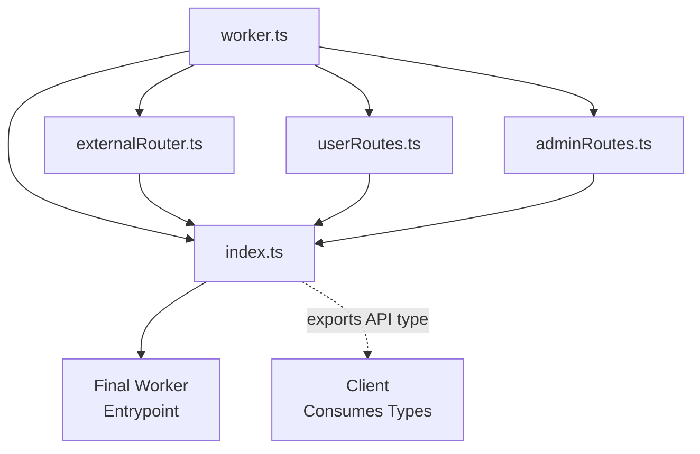

# Routing

Worker-Plugins uses a nested object-based routing system where URL paths are mapped to handler functions through object property traversal.

## Simple Router

Routes are defined as nested objects where each property corresponds to a path segment:

```typescript
import { createWorker } from "worker-plugins";
import { z } from "zod";

const worker = createWorker().router((route) => ({
  // Single endpoint: matches path []
  health: route.handle(async () => {
    return { status: "ok", timestamp: Date.now() };
  }),

  // Nested routes: matches path ["users", "list"]
  users: {
    list: route.handle(async () => {
      return await getAllUsers();
    }),

    // matches path ["users", "create"]
    create: route
      .input(
        z.object({
          name: z.string().min(1),
          email: z.string().email(),
        })
      )
      .handle(async ({ input }) => {
        return await createUser(input);
      }),
  },
}));

export default worker.entrypoint;
```

**How it works:**

- URL path segments are split by `/` and matched against object keys
- `POST /health` → matches `health` handler
- `POST /users/list` → matches `users.list` handler
- `POST /users/create` → matches `users.create` handler

**Note:** Currently all routes are handled as POST requests with JSON payloads. HTTP method differentiation is not yet implemented.

## Nested Routes

For larger applications, use nested routes to organize your API:

```typescript
import { createWorker } from "worker-plugins";
import { z } from "zod";

const worker = createWorker().router((route) => ({
  // API structure
  api: {
    v1: {
      // User management
      users: {
        // List users: POST /api/v1/users/list
        list: route.handle(async () => {
          return await getAllUsers();
        }),

        // Create user: POST /api/v1/users/create
        create: route
          .input(
            z.object({
              name: z.string().min(1),
              email: z.string().email(),
            })
          )
          .handle(async ({ input }) => {
            return await createUser(input);
          }),

        // User-specific operations
        profile: {
          // Get current user profile: POST /api/v1/users/profile/get
          get: route.handle(async ({ event }) => {
            // Access user info from middleware or session
            return await getCurrentUserProfile();
          }),

          // Update profile: POST /api/v1/users/profile/update
          update: route
            .input(
              z.object({
                name: z.string().min(1).optional(),
                bio: z.string().optional(),
              })
            )
            .handle(async ({ input }) => {
              return await updateCurrentUserProfile(input);
            }),
        },
      },

      // Admin operations
      admin: {
        // Admin dashboard: POST /api/v1/admin/dashboard
        dashboard: route.handle(async () => {
          return await getAdminDashboard();
        }),
      },
    },
  },

  // Public endpoints
  health: route.handle(async () => {
    return { status: "ok", version: "1.0.0" };
  }),
}));

export default worker.entrypoint;
```

**Route mapping examples:**

- `POST /api/v1/users/list` → `api.v1.users.list`
- `POST /api/v1/users/create` → `api.v1.users.create`
- `POST /api/v1/users/profile/get` → `api.v1.users.profile.get`
- `POST /health` → `health`

## Advanced Patterns

### Conditional Routing

Route based on request properties:

```typescript
const worker = createWorker()
  .before(async ({ event }) => {
    // Custom routing logic
    if (event.request.headers.get("X-API-Version") === "v2") {
      // Route to v2 handlers
      return;
    }
    // Default routing
  })
  .router((t) => ({
    // Routes
  }));
```

### Fallback Routes

Handle unmatched routes:

```typescript
const worker = createWorker()
  .router((t) => ({
    // Your routes here
  }))
  .before(async ({ event }) => {
    // Fallback for unmatched routes
    if (!event.path.length) {
      return new Response("Not Found", { status: 404 });
    }
  });
```

## Multi-File Routing

For larger applications, you can split your routing across multiple files while maintaining type safety and proper middleware application. This pattern allows for better code organization and separation of concerns.

### Architecture Overview

The multi-file routing pattern consists of three main components:

1. **Main Worker** (`worker.ts`) - Defines the core worker configuration, middleware, plugins, and base routing
2. **External Routers** (`externalRouter.ts`, `userRoutes.ts`, etc.) - Define specific route groups
3. **Entry Point** (`index.ts`) - Merges all routers and exports the final worker



### Implementation Pattern

**1. Main Worker (`worker.ts`)**

```typescript
import { createWorker } from "./lib/worker/worker";

// Define plugins as separate objects
const healthPlugin = {
  router: {
    health: route.handle(async () => ({ status: "ok" })),
  },
};

export const worker = createWorker()
  .use(healthPlugin) // Apply plugin
  .router((route) => ({
    // Base routes
    api: route.handle(async () => ({ status: "ok" })),
  }));
```

**2. External Router (`externalRouter.ts`)**

```typescript
import { worker } from "./worker";

export const externalRouter = (route: typeof worker.route) => ({
  // These routes will be merged into the main router
  api: {
    users: route.input(UserSchema).handle(async ({ input }) => {
      return await createUser(input);
    }),
  },
});
```

**3. Entry Point (`index.ts`)**

```typescript
import { worker } from "./worker";
import { externalRouter } from "./externalRouter";
import { userRoutes } from "./userRoutes";

// Merge all routers
const mergedWorker = worker
  .router(externalRouter) // Merge external routes
  .router(userRoutes); // Merge user routes

// Export for client type inference
export type API = (typeof mergedWorker)["~infer"];

export default mergedWorker.entrypoint;
```

### Benefits of This Pattern

- **Separation of Concerns**: Each file handles a specific domain (users, admin, API, etc.)
- **Type Safety**: External routers consume the worker's route type, ensuring compatibility
- **Middleware Consistency**: All routes inherit middleware from the main worker
- **Scalability**: Add new route files without modifying existing ones

### Adding New Route Modules

To add a new route module:

1. Create a new file (e.g., `adminRoutes.ts`)
2. Import the worker and create your router function
3. Import and merge in the main `index.ts`
4. The new routes are automatically available with full middleware support

```typescript
// adminRoutes.ts
import { worker } from "./worker";

export const adminRoutes = (route: typeof worker.route) => ({
  admin: {
    dashboard: route.handle(async () => ({ data: "admin dashboard" })),
    users: route.input(UserSchema).handle(async ({ input }) => {
      // Admin user management
    }),
  },
});
```

This pattern provides a clean, scalable way to organize complex routing while maintaining type safety and consistent middleware application across all routes.

## Next Steps

<CardGroup cols={2}>
  <Card
    title="Queue Processing"
    icon="queue"
    href="/worker/queues"
  >
    Learn how to handle background jobs and message queues.
  </Card>

  <Card
    title="Durable Object Integration"
    icon="database"
    href="/worker/durable-objects"
  >
    Understand how Workers communicate with Durable Objects.
  </Card>
</CardGroup>
